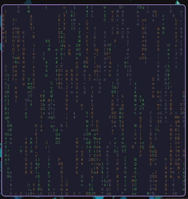

<div align="center">
<h1>matrix 🌧️</h1>
<p>A stupid simple matrix digital rain implemented in pure BASH v5.1+</p>

<br/>

</img>  
<a href="https://discord.gg/W4mQqNnfSq">
</a>

</div>

## Acquisition
stream `matrix` without downloading/installing
```bash
bash <(curl -s https://raw.githubusercontent.com/wick3dr0se/matrix/main/matrix.sh)
```

otherwise, download
```bash
git clone https://github.com/wick3dr0se/matrix; cd matrix
```

install to $PATH (optional)
```bash
cp matrix /usr/local/bin
```

## Execution
if installed to $PATH `matrix`, otherwise `./matrix` or `bash matrix`

### Let it rain

